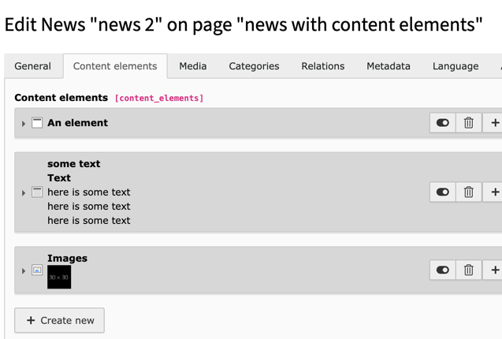

# TYPO3 Extension "news_irre_content_preview"

This extensions brings back the preview of a content element inside the backend view



Requirements:

- TYPO3 11.5 LTS
- EXT:news 10/11

## Installation

Install this extension via composer by using the following command:

```bash
composer require georgringer/news-irre-content-preview
```

or by downloading the extension from the TER and installing it in the Extension Manager.

## Thanks to

This feature has been sponsored by https://webconsulting.at/. Thanks a lot!
